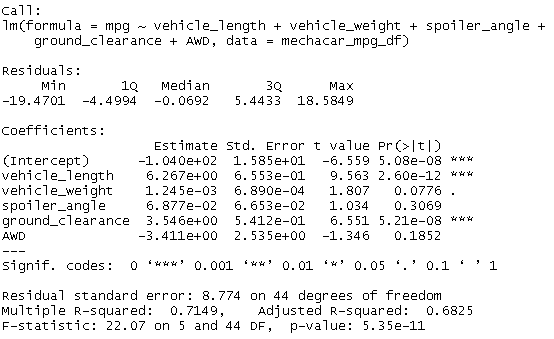
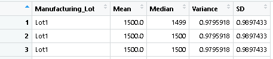
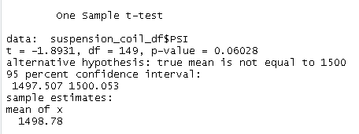
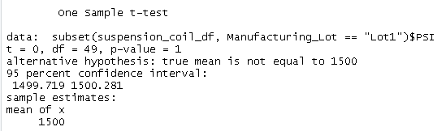
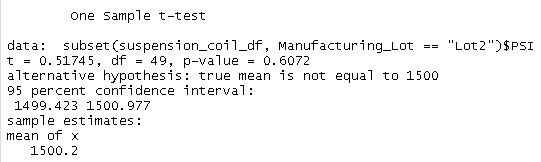
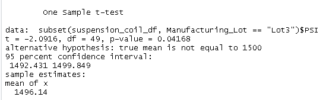

# MechaCar_Statistical_Analysis

## I. Linear Regression to Predict MPG

### 1.Which variables/coefficients provided a non-random amount of variance to the mpg values in the dataset?

The significant variables which show a non-random effect are ***vehicle_length*** and ***ground_clearance*** , they have the p-values lower than 0.05. The intercept is shown to also be significant.

### 2.Is the slope of the linear model considered to be zero? Why or why not?

The p-value is 5.35x10-11, and the slope of the linear model can't be considered zero. Havin a value of less than 0.05, the null hypothesis must be rejected. The relationship between the variables and mpg did not occur by random chance.

### 3.Does this linear model predict mpg of MechaCar prototypes effectively? Why or why not?

The model predicts the mpg of the MechaCar prototype with effectiveness as the r-squared value of 0.7149. A value above 0.7  generally indicates strong effectivity as they are closer to 1.

## II. Create Visualizations for the Trip Analysis

### A. Total Summary

### B. Lot Summary

## III.T-Tests on Suspension Coils

### A. All Lots

T-Test: not statistically different from the population mean
p-value: can't reject the null hypothesis.

### B. Lot 1

T-Test: not statistically different from the population mean
p-value: can't reject the null hypothesis.

### C. Lot 2

T-Test: not statistically different from the population mean
p-value: can't reject the null hypothesis.
### D. Lot 3

T-Test: not statistically different from the population mean
p-value: can't reject the null hypothesis.

## IV. Study Comparing the MechaCar to the Competition
